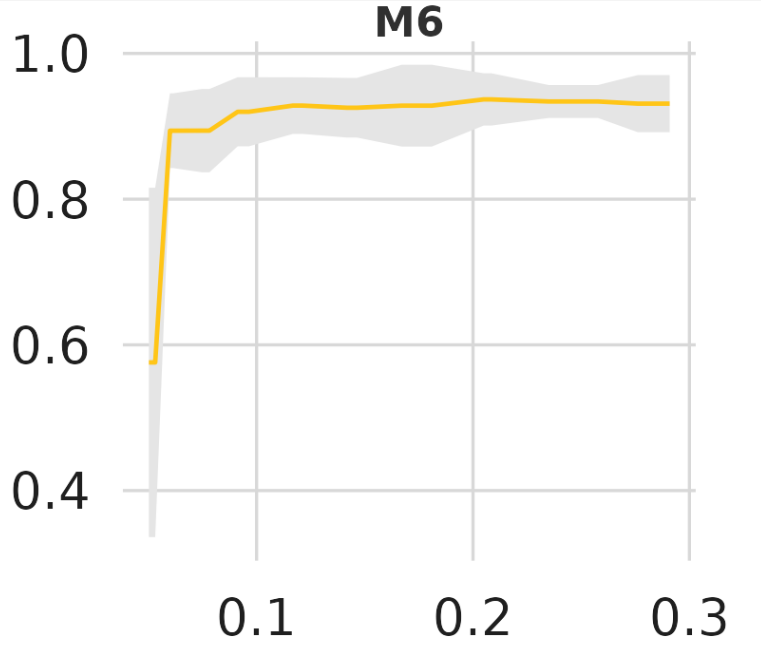

# Spencer: Accurate diagnosis criteria prediction for Breast Cancer MALDITOF samples.



## Introduction
This repository contains workflow and data required to train twelve models based on Biomarker Identification for Protein Sequences obtained through MALDI-TOF Mass Spectrometry. Also, contains the ready-to-use ML model accesible through Python (>=3.9) and related packages. The implementation allows users to get breast cancer predictions by applying a Bagging-SVM model over Proteic Sequences. 

* Input: A string from protein samples 
* Output: Probability and prediction for positive (1) or negative (0) findings. 

## Prerequisites

* Python (>3.9)
* NumPy (>1.14.3)
* SciPy (>1.0.0)
* Scikit-learn (>1.0.0)
* pandas (>0.22.0)
* joblib (>1.1)
* r-base (>4.0)
* Rcpi (>1.2)

# How to use

This repo contains two implementations. You can set a list of proteins as the *input.fasta* file, clone the whole repo and run the bash file:

```bash
sh spencer.sh
```
Or try the fresh and smooth shiny implementation.


## License

This repository is licensed under the terms of the GNU AGPLv3 license.

## Key Objective

Biomarkers are calculated from input sequences, and then used for final predicition. They include, but are not limited by:

| Descriptor         | Description                                                  |
|----------------|--------------------------------------------------------------|
| CIDH920105     | Normalized average hydrophobicity scales (Cid et al., 1992)  |
| BHAR880101     | Average flexibility indices (Bhaskaran-Ponnuswamy, 1988)    |
| CHAM820101     | Polarizability parameter (Charton-Charton, 1982)            |
| CHAM820102     | Free energy of solution in water, kcal/mole (Charton-Charton, 1982) |
| CHOC760101     | Residue accessible surface area in tripeptide (Chothia, 1976)|
| BIGC670101     | Residue volume (Bigelow, 1967)                               |
| CHAM810101     | Steric parameter (Charton, 1981)                             |
| DAYM780201     | Relative mutability (Dayhoff et al., 1978b)                  |

## Describe relation between proteic composition and breast cancer 

This repo cointains all the efforts to generate an ML ensemble-based prediction system with high accuracy and recall. In order to do so, the files are ordered inside three directories. 

### Warehousing
Here is the data warehousing process. It includes: outliers removal, minmax scaling and invariant columns removal. 

Data from [Soto, (2020)](https://github.com/muntisa/neural-networks-for-breast-cancer-proteins/tree/master/datasets) is recopiled and the process for data warehousing is replicated as a solo script. Relational data format is setted up. A minimax scaler is adapted for every column and then exported as *.pkl* file. Duplicated entries are removed, and then invariant columns, reducing features from 8742 to 8709. A PCA approach is applied and concludes more than 97% of the variance in class response is explained with 300 columns. Feature Subset Selection is applied, and unselected features are exported.   

### Training

The four best classifiers from muntisa paper are selected, trained and exported: **Decision Tree**, Support Vector Machine with **Radial** kernel basis function, **Logistic Regression** and **multilayer perceptron**. Cross-validation and stratified cross-validation processes are executed to estimate accuracy per model. Then, accuracy, recall, precision, F1 and roc-auc scores are calculated from the confusion matrix and get exported. The ensemble process includes twelve models for which Bagging SVMs have the best properties for prediction. 

### Evaluation

The refined model is evaluated with three partitions (70:20:10). 

